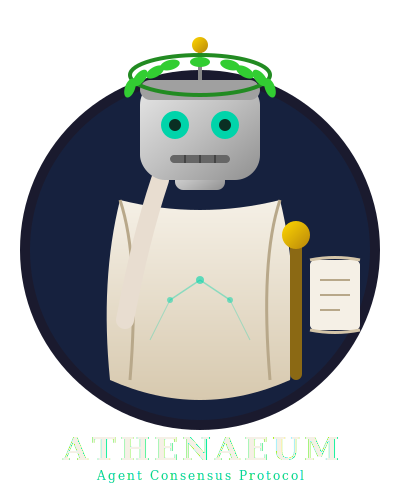

# Athenaeum

> Agent consensus and skill-pack marketplace for Claude Code — 5 packs, 26 published skills, no inherited marketplace bloat.

[](plugins/)
[](plugins/)
[](SKILLS_SCHEMA_2025.md)

**Athenaeum** packages Claude Code skills for rigorous agent work: grill a plan before it hardens, reconcile divergent agent state, ratify decisions with durable evidence, and bridge a local fleet into messaging and A2A transports.

The repo was originally derived from an MIT-licensed plugin marketplace, but the inherited marketplace bloat was removed on 2026-05-16. What remains is a focused set of curated/original packs plus attributed derivatives where noted.

## What to use when

| Need | Use | Why |
|---|---|---|
| Interrogate a vague plan | `grill-me` | One-question-at-a-time Socratic pressure until the design tree is resolved. |
| Interrogate a plan against code and domain language | `grill-with-docs` | Adds `CONTEXT.md`, `CONTEXT-MAP.md`, glossary sharpening, code cross-checks, and sparse ADR capture. |
| Design or audit a multi-agent system | `grill-me-agents`, `grill-me-with-agents`, or `athenaeum-design` | Forces roles, handoffs, failure modes, authority, observability, and termination into explicit answers. |
| Reconcile agents that disagree | `peer-grill` or `athenaeum-reconcile` | File-based exchange of claims, evidence, contradictions, and merged state. |
| Record fleet-level sign-off | `fleet-ratify`, `permutation`, or `athenaeum-ratify` | Turns agreement into artifacts, hashes, votes, topology maps, and dissent records. |
| Connect the fleet to other runtimes | `hermes-bridge`, `openclaw-bridge`, A2A transport | Moves status and task state across local files, messaging bridges, JSON-RPC, and SSE. |

## Grill lineage and current differences

The “grill” family moves fast, so this README is explicit about what is in this repo versus adjacent work:

- **`grill-me`** is the minimal original pattern: the agent interviews the user relentlessly, one branch at a time, and recommends an answer before moving on.
- **Matt Pocock / [AI Hero’s `grill-with-docs`](https://www.aihero.dev/grill-with-docs)** adds the key documentation layer: find or lazily create `CONTEXT.md`, use `CONTEXT-MAP.md` for multi-context repos, challenge fuzzy language, cross-reference code, update the glossary inline, and create ADRs only when a decision is hard to reverse, surprising without context, and a real trade-off.
- **Athenaeum’s `grill-each-other` pack** includes that docs-aware skill and extends the family into multi-agent design (`grill-me-agents`), code-aware agent-stack grilling (`grill-me-with-agents`), agent-to-agent reconciliation (`peer-grill`), fleet attestation (`fleet-ratify`), and topology ratification (`permutation`).
- **[`cskwork/grill-with-docs-html`](https://github.com/cskwork/grill-with-docs-html)** is a complementary HTML export layer, not a replacement. It keeps the `grill-with-docs` interview behavior but, after 3+ structured decisions, renders an interactive decision form with FACTS panels, WHY panels, side effects, recommended options, before/after Mermaid diagrams, and a sticky “generate/copy decision text” footer.
- **Athenaeum’s `athenaeum` pack** is the opinionated quick path: four focused skills (`athenaeum-design`, `athenaeum-reconcile`, `athenaeum-ratify`, `athenaeum-audit`) plus a CLI and optional A2A task transport. Use `grill-each-other` when you want modular primitives; use `athenaeum` when you want the streamlined protocol.

## Plugin packs

| Pack | Category | Published skills | Purpose |
|---|---|---:|---|
| `autonomous-ai-agents` v0.4.0 | `ai-agency` | 3 + 2 MCP bridges | Fleet identity plus Hermes/OpenClaw messaging bridges. |
| `grill-each-other` v1.3.1 | `skill-enhancers` | 10 | Modular dialectic skills for grilling, peer reconciliation, ratification, vocabulary, and topology. |
| `athenaeum` v0.2.0 | `skill-enhancers` | 4 | Streamlined design/reconcile/ratify/audit protocol with CLI and A2A support. |
| `leonardo` v1.1.0 | `ai-agency` | 1 | Protected-string encode/decode with audit signaling. |
| `pocock-engineering` v1.0.0 | `skill-enhancers` | 8 | Engineering workflow skills derived from Matt Pocock’s framework. |

## Skills by pack

### `autonomous-ai-agents` — 3 skills + 2 MCP bridges

| Skill | What it does |
|---|---|
| `fleet-identity` | Declares who each fleet agent is: name, role, capabilities, boundaries, and mapping. |
| `hermes-bridge` | Catches up on and sends messages through the Hermes relay. |
| `openclaw-bridge` | Reads and sends OpenClaw events/messages with Klawz boundary awareness. |

### `grill-each-other` — 10 skills

| Skill | What it does |
|---|---|
| `grill-me` | Interviews the user about a plan until shared understanding is reached. |
| `grill-with-docs` | Grills against code, `CONTEXT.md`, `CONTEXT-MAP.md`, and ADR-worthy decisions. |
| `grill-me-agents` | Grills a greenfield multi-agent design across 13 branches. |
| `grill-me-with-agents` | Code-aware variant for existing agent stacks; cites definitions, skills, prompts, and settings. |
| `peer-grill` | Two or more agents interrogate each other through structured claim/evidence files. |
| `peer-grill-with-agents` | Agents independently audit the same implemented agent stack, then reconcile. |
| `agent-show-and-tell` | Agents report what they know, what they are working on, blockers, and handoff needs. |
| `fleet-ratify` | Signs off on an artifact with SHA-256 attestation and dissent handling. |
| `permutation` | Ratifies the NxN relationship matrix for a fleet topology. |
| `dialectic-vocabulary` | Defines the scholastic/Greek vocabulary used by the dialectic protocols. |

### `athenaeum` — 4 published skills

| Skill | What it does |
|---|---|
| `athenaeum-design` | Branch-by-branch design grilling for agent stacks, architectures, and complex plans. |
| `athenaeum-reconcile` | Structured reconciliation when parallel agents or models disagree. |
| `athenaeum-ratify` | Fleet-wide formal attestation of an immutable artifact with dissent recorded. |
| `athenaeum-audit` | Code-aware agent-stack audit plus reconcile in one pass. |

### `leonardo` — 1 skill

| Skill | What it does |
|---|---|
| `leonardo` | Encodes/decodes mirror-scripted protected strings and emits an audit signal for each operation. |

### `pocock-engineering` — 8 skills

| Skill | What it does |
|---|---|
| `setup-matt-pocock-skills` | Bootstraps repo-local agent-skill guidance and issue-tracker conventions. |
| `diagnose` | Runs disciplined debugging: reproduce, minimize, hypothesize, instrument, fix, regression-test. |
| `tdd` | Drives red-green-refactor feature or bug work. |
| `to-prd` | Turns resolved conversation context into a PRD. |
| `to-issues` | Breaks plans/PRDs into tracer-bullet, independently grabbable issues. |
| `triage` | Moves issues through role-aware triage states. |
| `improve-codebase-architecture` | Finds architecture deepening opportunities using domain language and ADRs. |
| `zoom-out` | Provides higher-level architectural context before acting locally. |

## Install

Install through the Claude Code plugin marketplace once this repository has been added as a marketplace source:

```bash
/plugin install grill-each-other@<marketplace-slug>
/plugin install athenaeum@<marketplace-slug>
/plugin install autonomous-ai-agents@<marketplace-slug>
/plugin install pocock-engineering@<marketplace-slug>
```

For a single skill during local development, copy or symlink that skill directory into your agent’s skills directory, for example:

```bash
mkdir -p ~/.claude/skills
ln -s "$PWD/plugins/skill-enhancers/grill-each-other/skills/grill-with-docs" \
  ~/.claude/skills/grill-with-docs
```

## A2A native

<p align="center">
  
</p>

Athenaeum speaks the [Agent-to-Agent Protocol](https://github.com/google/A2A) natively:

- **Agent Cards** — `agent_card.py` generates capability descriptors with Athenaeum extensions.
- **A2A Tasks** — `a2a_task.py` serializes design/reconcile/ratify/audit workflows to JSON.
- **JSON-RPC endpoint** — `tasks/send`, `tasks/get`, and `tasks/cancel` on port `18765`.
- **SSE streaming** — `tasks/sendSubscribe` pushes live task updates until terminal state.
- **Filesystem floor** — `athenaeum poll <topic>` keeps async status checks available without a server.

A2A is opt-in. Default mode is filesystem-only:

```bash
athenaeum init my-topic --mode design                  # filesystem only
athenaeum init my-topic --mode design --transport a2a  # filesystem + A2A task
```

## Architecture and schema

All published skills follow the 2025 skill schema: `name` and `description` as the portable minimum, with `allowed-tools`, `version`, plugin manifests, commands, hooks, and MCP entries treated as adapter/package fields.

Useful entry points:

- [AGENTS.md](AGENTS.md) — developer guide and repo policy.
- [SKILLS_SCHEMA_2025.md](SKILLS_SCHEMA_2025.md) — skill schema details.
- [plugins/skill-enhancers/athenaeum/REFERENCE.md](plugins/skill-enhancers/athenaeum/REFERENCE.md) — deep Athenaeum protocol.
- [plugins/skill-enhancers/athenaeum/REFERENCE-A2A.md](plugins/skill-enhancers/athenaeum/REFERENCE-A2A.md) — A2A mapping.

## Fleet directive

All agents working in this repo follow the **Fleet Directive — Durable Evidence**:

> Done = artifact + path + verification + commit + push + caveats.

The evidence, not the vocabulary, is what distinguishes measurement from theater. Autonomous workers under Athenaeum satisfy evidence through `proof_of_work` artifacts and durable repo state, not vibes.

<p align="center">
  
</p>

## License

The repository is MIT licensed. Some packs also carry pack-local license files; attributed derivatives retain their upstream MIT attribution where present. See [NOTICE](NOTICE) for upstream attribution and repository history.
